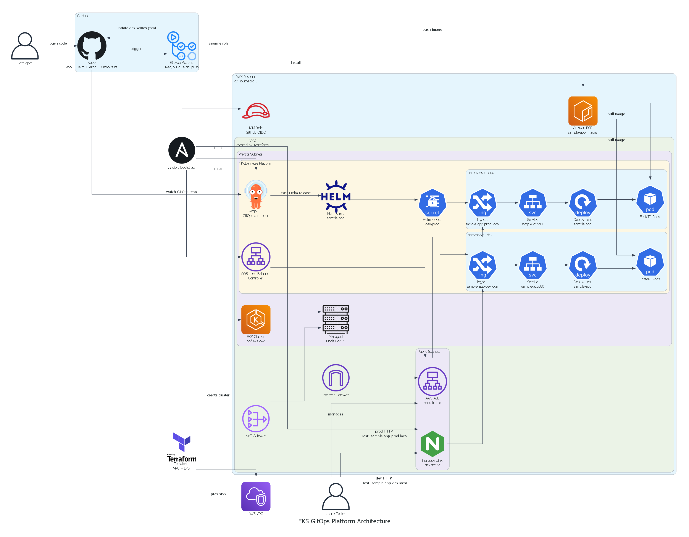

# EKS GitOps Platform

This repository presents a production-style AWS EKS platform for deploying a sample application with Terraform, Docker, Kubernetes, GitOps, CI/CD automation, and security scanning. It is designed as a portfolio-ready project that demonstrates modern cloud-native engineering practices in a practical, end-to-end workflow.

## Architecture Overview



## Why This Project Matters

This project is built to showcase a realistic platform engineering workflow that covers the full delivery lifecycle:

- Infrastructure provisioning on AWS with Terraform
- Kubernetes cluster deployment on Amazon EKS
- Application containerization with Docker
- Automated CI/CD pipelines with GitHub Actions
- Image scanning and security validation with Trivy
- GitOps-based deployment with Argo CD and Helm
- Environment separation for development and production

## Key Technologies

- Terraform for infrastructure as code
- Amazon EKS for container orchestration
- Docker for application packaging
- Helm for Kubernetes deployment templating
- Argo CD for GitOps-based synchronization
- GitHub Actions for automation
- Ansible for platform bootstrap
- Trivy for container image security scanning

## What the Repository Contains

- Terraform modules and environment configuration for AWS networking and EKS in [eks-platform-infra](eks-platform-infra)
- Ansible automation for platform bootstrap in [automation/ansible](automation/ansible)
- A sample FastAPI application in [sample-app-gitops/app](sample-app-gitops/app)
- Helm charts and environment-specific values in [sample-app-gitops/helm](sample-app-gitops/helm) and [sample-app-gitops/envs](sample-app-gitops/envs)
- Argo CD manifests in [sample-app-gitops/argocd](sample-app-gitops/argocd)

## Repository Structure

```text
.github/workflows/ci.yml              CI/CD workflow
eks-platform-infra/                   Terraform for AWS and EKS
automation/ansible/                   Bootstrap automation for platform services
sample-app-gitops/app/                Sample FastAPI application source
sample-app-gitops/helm/sample-app/    Helm chart for the application
sample-app-gitops/envs/               Environment values for dev and prod
sample-app-gitops/argocd/             Argo CD project and applications
```

## CI/CD Workflow

When the workflow runs, it performs the following steps:

1. Checks out the source code and validates the application.
2. Assumes an AWS IAM role through GitHub OIDC.
3. Builds the container image for the sample application.
4. Scans the image with Trivy and fails on HIGH or CRITICAL issues.
5. Pushes the image to Amazon ECR.
6. Updates the deployment image tag for the target environment.
7. Allows Argo CD to synchronize the updated state into the EKS cluster.

## Required GitHub Secrets

Create the following repository secrets in GitHub:

```text
AWS_ACCOUNT_ID
AWS_GITHUB_ACTIONS_ROLE_ARN
```

- `AWS_ACCOUNT_ID` is used to construct the ECR registry URL in the workflow.
- `AWS_GITHUB_ACTIONS_ROLE_ARN` is the IAM role that GitHub Actions assumes through OIDC.

## Portfolio-Ready Highlights

This project demonstrates practical experience in:

- Infrastructure as Code and reusable Terraform modules
- Kubernetes platform operations on EKS
- GitOps deployment strategies with Argo CD
- Secure CI/CD automation and image assurance
- Environment-based configuration for multi-stage delivery

## Documentation

For a full end-to-end setup guide, please refer to [HOWTO.md](HOWTO.md).

To regenerate the architecture diagram locally, use [architecture.py](architecture.py).

## Notes

- Avoid broad staging commands such as `git add .` when reviewing unfamiliar changes.
- Keep secrets out of version control.
- Maintain consistent line endings when working across Windows and Linux environments.
- When CI fails, inspect the failing step logs before making broad changes.

## Accessing Argo CD

Argo CD is not exposed publicly by default. A secure approach for local access is to use port forwarding:

```bash
kubectl port-forward svc/argocd-server -n argocd 8080:443
```

Then open:

```text
https://localhost:8080
```

This provides a temporary secure tunnel from your local machine to the cluster without making Argo CD publicly reachable.

## Notes

- Avoid broad staging commands such as `git add .` when reviewing unfamiliar changes.
- Keep secrets out of version control.
- Maintain consistent line endings when working across Windows and Linux environments.
- When CI fails, inspect the failing step logs before making broad changes.
